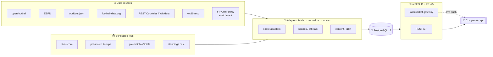

# worldcup-backend

> A fast, modular backend for a **FIFA World Cup 2026 companion app** — REST + WebSocket, powered by a **pre-loaded PostgreSQL dataset** you get the moment you clone.

[](LICENSE)


[](https://github.com/emrbli/worldcup/actions)
[](CONTRIBUTING.md)

---

## 🎁 What you get when you clone this repo

> **The database ships pre-loaded.** Clone, start Postgres, and a complete, normalized tournament dataset is already sitting in your tables — no scraping, no API keys, no waiting.

| 🗂️ Domain | 📦 What's inside |
|---|---|
| 🏳️ **48 teams** | World ranking · crest/logo · **official 26-man squads** (shirt number, position, club, birth date, nationality) · **names in 30+ languages** · head coach (+ nationality) |
| 🅰️ **12 groups · 104 matches** | Kickoff in **UTC** · venue · stage · knockout placeholders · multi-source IDs |
| 🏟️ **16 stadiums** | Capacity · lat/lng · photo · + 16 host cities (with timezone) |
| 🏆 **Knockout** | **32 bracket slots** · **48 standings rows** |
| 📺 **14,729 broadcast/TV listings** | Across **91 markets** — per-country, including Türkiye |
| 📰 **Content** | City guides (16) · fan zones (18) · visa info (42) · historical head-to-head (34) · news (53) · odds (16) |
| 🔴 **Live-ready tables** | Match events, lineups, stats, officials, tournament leaders — **schema + sync pipeline already in place**; they populate on match day, right down to per-minute match events. |

> **Clone → `docker compose up` → the full dataset is already there. No API keys needed to explore.**

---

## ⚖️ Disclaimer

> This project is **not affiliated with, endorsed by, or connected to FIFA** or any of its subsidiaries. All trademarks belong to their respective owners. Data is aggregated from publicly available sources and provided **as-is** for **educational / non-commercial** use; you are responsible for complying with each upstream source's Terms of Service. No FIFA emblem, mascot, or official ball imagery is stored. See [`DISCLAIMER.md`](DISCLAIMER.md).

---

## 🚀 Quick start (plug-and-play)

```bash
git clone https://github.com/emrbli/worldcup.git && cd worldcup
docker compose up -d          # Postgres + auto-restores the bundled dataset (db/dump)
cp .env.example .env          # optional: add FOOTBALL_DATA_TOKEN to refresh live data
pnpm install
pnpm dev                      # http://localhost:3000  ·  Swagger UI: /docs
```

That's it — the API is live and every endpoint already returns real data.

<details>
<summary><b>🔧 Other useful flows</b></summary>

- **Rebuild the dataset from scratch** (instead of restoring the snapshot): `pnpm dataset:build` — needs a free [football-data.org](https://www.football-data.org/client/register) token + network access.
- **Reset the database** (wipe volume, re-restore on next start): `docker compose down -v && docker compose up -d`
- **Reload the bundled snapshot manually**: `bash scripts/db-restore.sh`

The Postgres container auto-restores `db/dump/worldcup.sql.gz` via the official image's init hook on the **first** start of an empty volume.

</details>

---

## 🧱 Tech stack

| Layer | Choice |
|---|---|
| Runtime | **Node.js 24 LTS** |
| Framework | **NestJS 11** + **Fastify v5** adapter |
| Language | **TypeScript 5** (strict) |
| Data | **Drizzle ORM** + `drizzle-kit` · **PostgreSQL 17** |
| Validation | **Zod** (via `nestjs-zod` → OpenAPI) |
| Realtime | **WebSocket** (native `ws`) |
| Scheduling | `@nestjs/schedule` |
| Enrichment | **Python crawlers** (`crawl4ai`) — offline, never a runtime dependency |

---

## 📊 Data inventory

| Table | Rows | Source |
|---|---:|---|
| Teams | 48 | openfootball · football-data |
| Squad players | ~1,248 | football-data · FIFA first-party (enrichment) |
| Groups | 12 | openfootball |
| Matches | 104 | openfootball |
| Stadiums | 16 | openfootball |
| Host cities | 16 | openfootball |
| Bracket slots | 32 | openfootball |
| Standings rows | 48 | computed |
| Team name translations | 30+ langs | REST Countries · Wikidata |
| Broadcasts / TV listings | 14,729 | FIFA first-party (enrichment) |
| Markets covered | 91 | FIFA first-party (enrichment) |
| City guides | 16 | wc26-mcp |
| Fan zones | 18 | wc26-mcp |
| Visa info | 42 | wc26-mcp |
| Head-to-head | 34 | wc26-mcp |
| News | 53 | wc26-mcp |
| Odds | 16 | wc26-mcp |
| Match events · lineups · stats · officials · leaders | **0 until match day** | ESPN · worldcupjson · football-data *(schema ready, sync wired)* |

---

## 🌐 Data sources (in authority order)

| # | Source | Auth | Fills | Mode |
|---|---|---|---|---|
| 1 | **openfootball** | none | fixtures, teams, groups, venues | static (canonical backbone) |
| 2 | **ESPN** (hidden API) | none | live scores / events / lineups | live (primary) |
| 3 | **worldcupjson.net** | none | live scores | live (fallback) |
| 4 | **football-data.org** | free token | full squads, crests, coaches, referees, scores | static + live fallback |
| 5 | **REST Countries** | none | multilingual team names | static |
| 6 | **Wikidata** | none | additional language names | static |
| 7 | **Wikipedia** (via crawl4ai) | none | player clubs, stadium photos | crawl |
| 8 | **wc26-mcp** (npm) | none | city guides, fan zones, visa, H2H, news, odds, profiles | embedded |
| 9 | **FIFA first-party (enrichment)** | none | broadcasts, world ranking, squad numbers, standings/timelines | static + optional enrichment *(generic; see Disclaimer)* |

Most sources are **free and unauthenticated**; only football-data.org needs a free token.

> **Field authority:** live score is resolved **ESPN → worldcupjson → football-data**. FIFA first-party data is **enrichment only** and is **never the score authority** — this prevents source conflicts and score flapping.

---

## 🏗️ Architecture



Each source is an isolated **adapter** (`fetch → normalize → upsert`). The canonical ID is openfootball; foreign source IDs live in a `source_ids` JSONB column, so adding a new source never breaks existing rows.

---

## 🔌 API endpoints

Interactive docs (Swagger UI) at **`/docs`**.

| Group | Endpoints |
|---|---|
| 💚 Health | `GET /health` |
| 🏳️ Teams | `GET /teams` |
| 🅰️ Groups | `GET /groups` |
| ⚽ Matches | `GET /matches` · `GET /matches/:id` · `GET /matches/:id/events` · `GET /matches/:id/lineups` |
| 📊 Standings | `GET /standings` |
| 🏆 Bracket | `GET /bracket` |
| 📰 Content | `GET /content/teams/:id/profile` · `GET /content/cities` · `GET /content/cities/:id/guide` · `GET /content/h2h/:a/:b` · `GET /content/fan-zones` · `GET /content/visa` · `GET /content/news` · `GET /content/odds` |
| 📱 Devices | `POST /devices` |
| 🔴 Realtime | **WebSocket** channel for live match updates |

---

## 🛠️ Commands

Package manager: **pnpm**.

| Command | What it does |
|---|---|
| `pnpm dataset:build` | One-command full dataset build (seed + enrich + verify) |
| `pnpm dataset:verify` | Verify counts (48 teams / 12 groups / 104 matches / 16 venues) |
| `pnpm dev` | Dev server, hot reload (`http://localhost:3000`) |
| `pnpm build` | Compile TypeScript → `dist/` |
| `pnpm migrate` | Apply migrations · `pnpm db:generate` — generate migration from schema |
| `pnpm seed` | openfootball backbone seed (idempotent) |
| `pnpm seed:content` | Seed wc26-mcp content (cities, visa, news, odds…) |
| `pnpm seed:i18n` | Seed multilingual team names |
| `pnpm seed:squads` | Seed 26-man squads |
| `pnpm enrich:squads:fifa` | Enrich squad numbers / details (enrichment) |
| `pnpm sync:live [YYYY-MM-DD]` | One-shot live-score sync for a date |
| `pnpm sync:officials` | Pull match referees / officials |
| `pnpm sync:fifa` | Optional enrichment sync |
| `pnpm calc:standings` | Recompute group standings |
| `bash scripts/db-restore.sh` | Reload the bundled DB snapshot |
| `pnpm test` · `pnpm test:e2e` | Unit + end-to-end tests |
| `pnpm lint` | ESLint (+ autofix) |

---

## ⚙️ Configuration

Copy the template and fill it in:

```bash
cp .env.example .env
```

| Variable | Required? | Purpose |
|---|---|---|
| `DATABASE_URL` | ✅ yes | Postgres connection string |
| `PORT` | optional | HTTP port (default `3000`) |
| `FOOTBALL_DATA_TOKEN` | optional | **Free** token — only needed to refresh squads / officials / live data |

All background sync jobs (`LIVE_SYNC_ENABLED`, `OFFICIALS_SYNC_ENABLED`, `LINEUPS_SYNC_ENABLED`, `PUSH_ENABLED`, …) are **env-flag gated and OFF by default** — the bundled dataset is fully usable without any of them.

---

## 📁 Project structure

```
worldcup-backend/
├── src/
│   ├── adapters/        # per-source: fetch → normalize → upsert (espn, worldcupjson, football-data, fifa)
│   ├── jobs/            # scheduled jobs (live-score, lineups, officials, standings, fifa-sync)
│   ├── domain/          # ports / domain contracts (e.g. live-score.port)
│   ├── lib/db/          # Drizzle schema + DB module
│   ├── teams/ groups/ matches/ standings/ bracket/ content/ devices/   # feature modules
│   ├── health/  realtime/  notifications/  config/
│   └── main.ts
├── db/
│   ├── migrations/      # forward-only Drizzle migrations
│   ├── seed/            # seed sources (openfootball, i18n, wc26mcp, squads)
│   └── dump/            # bundled dataset snapshot (auto-restored by docker compose)
├── crawler/            # Python enrichment (crawl4ai) — offline, run on a timer
├── scripts/            # dataset build / verify / sync / restore
└── test/               # e2e tests
```

---

## 🤝 Contributing · License · Attribution

- **Contributing** — see [`CONTRIBUTING.md`](CONTRIBUTING.md). PRs welcome.
- **License** — [MIT](LICENSE).
- **Data attribution** — see [`ATTRIBUTION.md`](ATTRIBUTION.md).
- **Disclaimer** — see [`DISCLAIMER.md`](DISCLAIMER.md).

<sub>Not affiliated with or endorsed by FIFA. For educational / non-commercial use.</sub>
