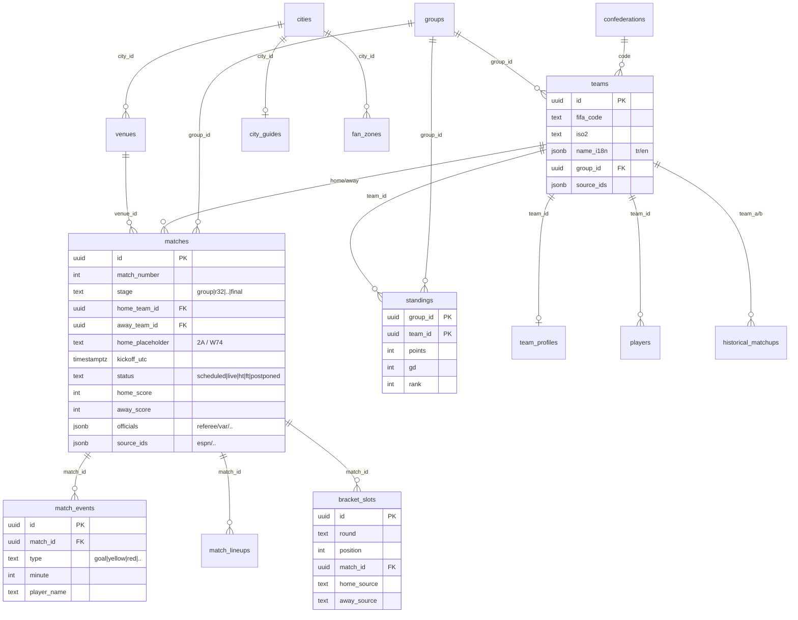
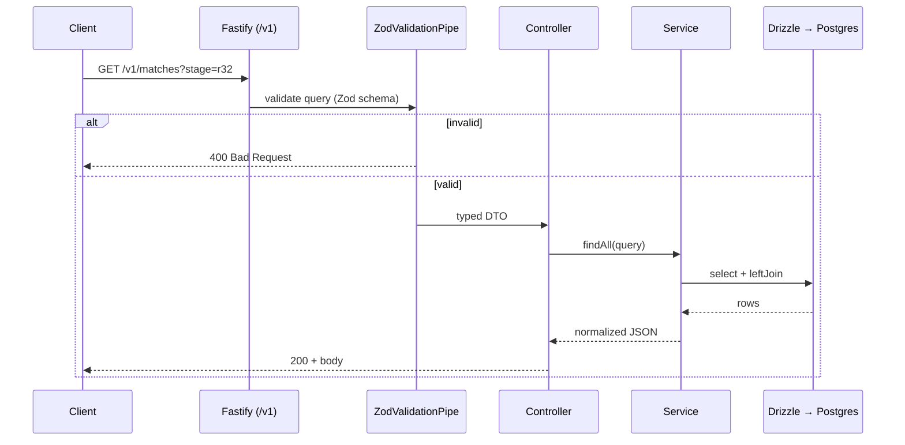
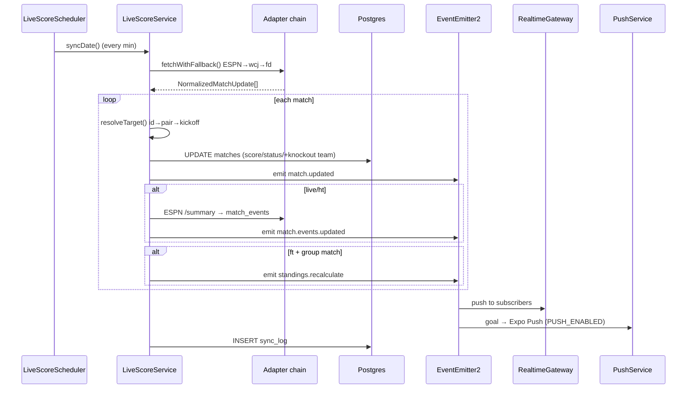
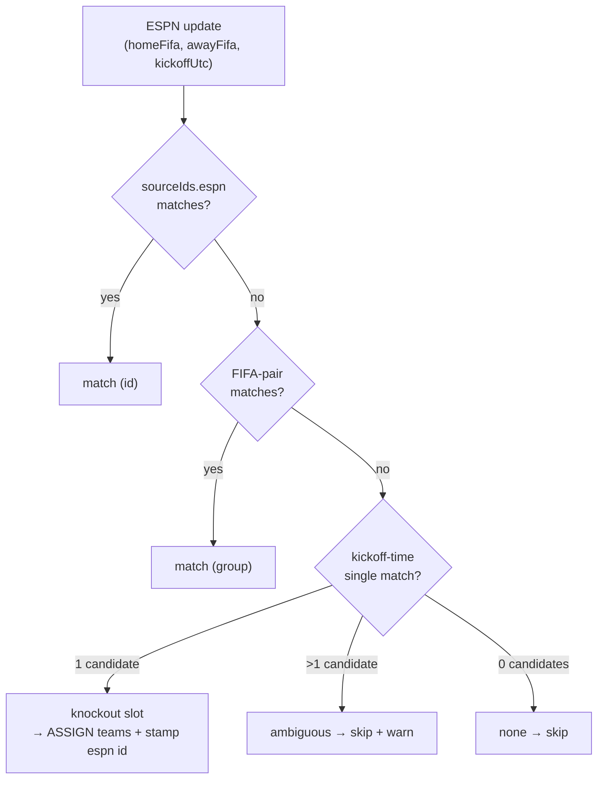

# Architecture — worldcup-backend

This document illustrates the schema relationships, request lifecycle, and live
sync flow with diagrams. For a high-level overview see the [README](../README.md).

---

## 1. Data schema (ER)

Full DDL and module list: `src/lib/db/schema/` (core · live · bracket · content · devices · ops).
Canonical ID = openfootball; other sources are mapped into `source_ids jsonb` (without schema changes).

---

## 2. Request lifecycle (REST)

UUID path params are validated with `ParseUUIDPipe` (invalid → 400, not found → 404).

---

## 3. Live sync loop

---

## 4. Data source authority

To prevent conflicts/flapping, the authority for each field is fixed.

| Data | Primary | Fallback | Authority note |
|---|---|---|---|
| Fixtures/groups/venues | openfootball | — | Canonical ID source (seed) |
| Live score/status/minute | ESPN | worldcupjson → football-data | Field-based: this service fixes it |
| Live events (goal/card) | ESPN `/summary` | — | match_events dedup (unique index) |
| Officials | football-data | API-Football | Pre-match cron, idempotent |
| Lineups | ESPN `/summary` rosters | — | Pre-match cron |
| Standings | **computed** | — | Derived from match results |
| Content (profile/guide/H2H/visa) | wc26-mcp | — | Static seed (MIT) |
| Multilingual name | REST Countries | hard-code (ENG/SCO) | Seed-time |

---

## 5. Knockout linker (resolveTarget)

Once the group stage ends, ESPN publishes the knockout teams. Our knockout matches
start with `home_team_id`/`away_team_id` = NULL (placeholder "2A"). Matching:

In the real 2026 calendar no knockout match shares the same kickoff moment →
no ambiguity risk (verified). After the first assignment `sourceIds.espn` is stamped,
so subsequent syncs match by `id`.
</content>
</invoke>
